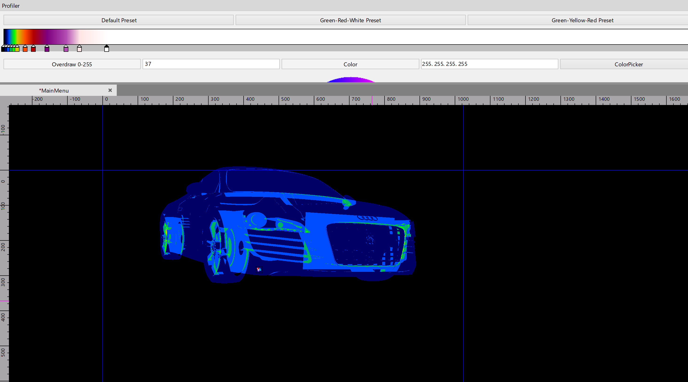
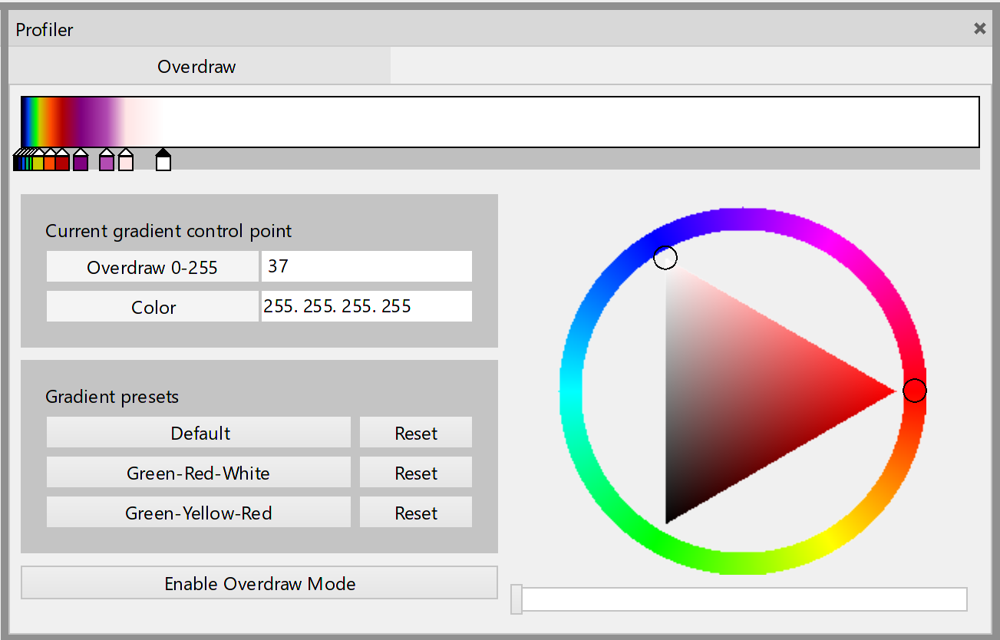

# Overdraw

With Overdraw mode you can determine the number of fragment shader calls for each pixel on the screen.



⚠ If objects are rendered to an intermediate buffer, and then this buffer is drawn to the main framebuffer, the Overdraw metric will be equal to 1 for the whole intermediate buffer. You can observe this effect at least for post-processing.

## Getting started

### Tangerine

The Overdraw mode is configured through the profiler pane.



You can enable this mode with Profiler pane or you can use scene command `Toggle Overdraw Mode`.

You can set custom overdraw colors with gradient editor on Profiler pane.

### Code

Use property `Overdraw.Enabled` in namespace `Lime.Profiler.Graphics` to enable overdraw visualization mode. It's disabled by default. To find out whether the Overdraw mode is currently enabled, use the `Overdraw.EnabledAtUpdateThread` and `Overdraw.EnabledAtRenderThread` for update and render threads respectively.

Use `Gradient` property in `OverdrawInterpreter` class in namespace `Lime.Profiler.Graphics` to configure colors.

## Project level overdraw support

To enable overdraw support in the engine, define `PROFILER` symbol at following projects:

- Lime
- Tangerine.UI.Profiler <span style="color:gray">(only if you want to use overdraw in the scene editor)</span>
- Tangerine.UI.SceneView <span style="color:gray">(only if you want to use overdraw in the scene editor)</span>

### The easiest way to do it:

- For Tangerine Overdraw mode is enabled by default. So you don't have to do anything
- For game use Lime project configuration `Release.Profiler` or `Debug.Profiler`

⚠ The profiler code inside Lime is enclosed in define guard. This is done to exclude a negative impact on the size of the executable files of the game. So if you are writing code that depends on the profiler code, you must surround it with define guard and you must also set `PROFILER` symbol in the properties of these projects.

```c#
// define guard
#if PROFILER
// place your code here
#endif // PROFILER
```

## Overdraw foreground UI

To draw the interface on top of the overdraw, you need to add `OverdrawForegroundComponent` to a Widget.

If overdraw mode is disabled, `OverdrawForegroundComponent` has no effect on rendering.

If overdraw mode is enabled, objects are drawn with their original materials after all objects in the scene.

⚠ Objects do not change their transform, hierarchy position location. Only rendering order is changed. That means clickability of the widgets is being preserved.

⚠  `OverdrawForegroundComponent` affects all child nodes.

## How it works

Scene rendering in overdraw mode is divided into three phases:

- Rendering the scene to a render texture
- Interpret results with a given gradient
- Draw objects with `OverdrawForegroundComponent`

In the first phase, we

- redirect the rendering of all objects to a render texture.
- replace object shaders and blending.

Overdraw shaders are created by replacing the body of the `main` function of the original fragment shaders:

```glsl
// Original fragment shader
void main() {
    // shader code ...
    gl_FragColor = // shader code ...
    // shader code ...
}
```

```glsl
// Overdraw fragment shader
void main() {
    gl_FragColor = vec4(1 / 256, 0, 0, 1);
}
```

The vertex shader never changes. Also, every draw call of scene objects will use additive blending. As a result, we will get a render texture filled with shades of red.

In the second phase, we apply a gradient to this render texture to make the individual overdraw states more distinguishable. There can be 256 overdraw states in total. And next, we draw the results on top of the scene.

In the final third phase, we draw object subtrees that have `OverdrawForegroundComponent` at their root. For this, objects are added to a separate RenderChain. Objects are also added to the original scene RenderChain, but in this chain they will not be rendered! This is done for the hit test to work.

## Overdraw metrics

You can also get an average number of redraws for all game (scene) pixels for a frame. Nodes with `OverdrawForegroundComponent` will not affect this metric.

Set `Overdraw.MetricRequired` to `true` and subscribe to `Overdraw.MetricCreated` event.

⚠ `Overdraw.MetricCreated(float averageOverdraw, int pixelCount)` will be invoked from render thread.

⚠ Obtaining the metric is a very expensive operation. The higher your screen resolution, the worse the performance.

